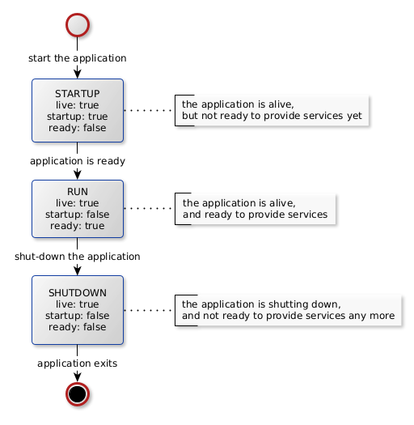

go-12f-common
=============

[](https://github.com/tombenke/go-12f-common)

## About

The common packages of a [12-factor application](https://12factor.net/) written in Golang.

This repository holds those infrastructure-level modules,
that every application requires that follows the core [12-factor principles](https://12factor.net/).

This package can be used to create 12-factor applications with the following built-in features:

- Configurability.
- Full lifecycle management of the application and its internal components.
- Graceful shutdown.
- Healthcheck of the application and its components.
- Structured logging.
- Open Telemetry instrumentation for metrics and tracing.

### Configurability

Figure 1. shows the structure of a typical application:


Every application is made of an Application object, which may hold one or more components.

Both the application and its internal components can be configured a common way,
via CLI parameters, environment variables and config files.
The implementation of configurability is based on [Cobra](https://cobra.dev/) and [Viper](https://github.com/spf13/viper).

The application object and its components may have configuration objects. The configuration objects assigned to the corresponding component typically hold parameters, that directly belongs to that component. These component-level configuration objects can be integrated into the central configuration object of the application, that may have additional, application-level configuration parameters.

Every configuration object must implement the `apprun.Configurer` interface:

- `GetConfigFlagSet()`: is a factory function that receives a reference to the main `pflag.FlagSet` config aggregate object, to that it puts its own configuration parameters.

- `LoadConfig()`: resolves the actual values of the configuration object. It takes into account the parameter definitions, the CLI and environment variables and the default values as well.

### Lifecycle Management with graceful shutdown

Every application has a lifecycle. The Figure 2. shows the states of the application that goes through during its lifecycle:



The application object must implement the `apprun.Application` interface in order to have its lifecycle managed.
Moreover the components inside the application must implement the `apprun.ComponentLifecycleManager` interface.

The `apprun.ComponentLifecycleManager` interface defines the following functions:

- `Startup()`: The component should initialize itself and start a loop in a goroutine if necessary. When the loop is started, the component should signal that it's ready and healthy.
- `Shutdown()`: Shuts down the component. If a loop has been started it should be graceful shut down and the component should signal that it's not ready anymore.
- `Check()`:  It is called by the healthcheck API. If this function returns no error, then the component is considered healthy.

There are additional hooks an application can subscribe to:

- `AfterStartup`: Called after the components are initialized and became healthy. Parts of the application that depends on the components should be initialized here.
- `BeforeShutdown`: Called before the components are being shut down.
- `Check`: The application can also signal that it's not healthy. This is completely optional, the application is considered healthy when all of it's components are healthy by default


The `apprun.MakeAndRun()` wrapper function manages the configuration and lifecycle of a complete application.
It only needs the application level configuration aggregate, and the constructor of the application object and the main package of the application can be as simple as this:

```go
package main

import (
	"github.com/tombenke/go-12f-common/apprun"
	"github.com/tombenke/go-12f-common/must"
)

func main() {

	// Make and run an application via ApplicationRunner
	must.Must(apprun.MakeAndRun(&Config{}, NewApplication))
}
```

The `apprun.MakeAndRun()` does the following:

1. Creates a new application-level configuration aggregate object, that holds those parameters, that every application must have (e.g. health-check port, log-level, etc.).
2. Resolves the configuration parameters to the application and its components.
3. Calls the constructor function of the application with the complete, resolved configuration aggregate object.
4. Set the log level and log format of the logger module,
5. Starts the service endpoints for liveness and health-check (live: `true`, ready: `false`).
6. Enters the STARTUP state: calls the `Startup()` method of the application's components.
7. Waits until all components become healthy or times out.
8. If provided, the application's `AfterStartup()` hook is called.
9. When the application enters the RUN state, it registers the signal handler function for graceful-shutdown, then it keeps running its state until a kill or shutdown signal is not arrived.
10. When the application got either `syscall.SIGINT` or `syscall.SIGTERM` signal to shut down, it disables the readiness check, and enters the SHUTDOWN state.
11. If provided, the application's `BeforeShutdown()` hook is called.
12. Calls `Shutdown()` on the components.
13. When all internal components has been successfully stopped, the application terminates.

The system components may fork their own service processes as a goroutine, that run either until they decide to stop, or the application needs to shut down. So that The application has a central `sync.WaitGroup` to that the components' `Startup()` functions got a reference as a parameter. Every system that forks its own subprocess must `Add()` itself to this waitgroup, and make sure it will call the `Done()` on this central waitgroup when this subprocess terminates, so that the application can wait for all the running internal processes to join.

When the application shuts down, it will call the `Shutdown()` method of each system component. 
It is the system components' decision and responsibility how many subprocesses it forks, and how it will terminate its forked subprocesses but it must be able to do at at least, when its `Shutdown()` method is called.

A typical pattern to implement this, to have a local channel inside the system component, that it shares with the subprocesses that is forks, then the subprocesses will do their job, until this channel is not closed. The only think the system component has to do in its `Shutdown()` method is, to close this channel.

See the [examples/scheduler](examples/scheduler/) as a sample for more details in this topic.


### Healthcheck

The application provides REST endpoints to check its readiness and health status.
This feature is mostly used by docker or kubernetes environments.

The application health check applies to each internal component.

See also the application state diagram on the Figure 2.

The application-level configuration parameters of the health-check endpoints:

Health-Check Port:
- cli parameter: `--health-check-port`
- env. variable: `--HEALTH_CHECK_PORT`
- default: `8080`.
	
Liveness-Check Path:
- cli parameter: `--liveness-check-path`.
- env. variable: `LIVENESS_CHECK_PATH`.
- default: `"/live"`.

Readiness-Check Path
- cli parameter: `--readiness-check-path`.
- env. variable: `READINESS_CHECK_PATH`.
- default: `"/ready"`.

### Structured Logging

The [`/github.com/tombenke/go-12f-common/log`](log/) package is based on the [slog](https://pkg.go.dev/log/slog) package of the standard library.
This is the preferred way of logging with the 12-factor application. This package provides some additional helper functions,
so either you can use these extensions and/or the original [slog](https://pkg.go.dev/log/slog) package at the same time.

The application-level configuration parameters of the logger:

The log level:
- cli parameter: `--log-level`.
- env. variable: `LOG_LEVEL`.
- type: String. One of `panic, fatal, error, warning, info, debug, trace`.
- default value: `info`.

Log format:
- cli parameter: `--log-format`.
- env. variable: `LOG_FORMAT`.
- type: String. One of `json, text`.
- default value: `json`.

### Observability Instrumentation

The observability feature is fully rely on the [Open Telemetry](https://opentelemetry.io/) (shortly OTEL) standard.

The [`/github.com/tombenke/go-12f-common/oti`](oti/) package uses the [OpenTelemetry-Go](https://pkg.go.dev/go.opentelemetry.io) package to instrument a global MetricProvider and a TracerProvider that the applications can use to add their own meter instruments and tracing features.

The configuration of the OTEL instrumentation uses the following parameters:

The following environment 

Service Name:
- description: The name of the service that collects metrics and tracing.
- cli parameter: N.A.
- env. variable: `OTEL_SERVICE_NAME`.
- type: String.
- default value: N.A.

OTEL Resource Attributes:
- description: It holds OpenTelemetry Resource information in the form of commaseparated key-value pairs.
- cli parameter: N.A.
- env. variable: `OTEL_RESOURCE_ATTRIBUTES`.
- type: String.
- default value: N.A.

Otel Metrics Exporter:
- description: Specifies which exporter is used for metrics.
  Possible values are: "otlp": OTLP, "prometheus": Prometheus, "console": Standard Output, "none": No automatically configured exporter for metrics.
- cli parameter: `--otel-metrics-exporter`.
- env. variable: `OTEL_METRICS_EXPORTER`.
- type: String. One of `otlp | prometheus | console | none`.
- default value: `none`.

Otel Exporter Prometheus Port:
- description: Specifies the port that the prometheus exporter uses to provide the metrics.
- cli parameter: `--otel-exporter-prometheus-port`.
- env. variable: `OTEL_EXPORTER_PROMETHEUS_PORT`.
- type: Integer.
- default value: `9464`.

It is also possible to set the so called `service.version` resource attribute.
This version parameter can be injected into the application via the `-ldflag` argument of the go linker.
The actual `version` variable is defined in the [buildinfo/buildinfo.go](buildinfo/buildinfo.go) file.

If the `version` got a value from the linker, then it is used to set the corresponding resource attribute.
If it is nod injected, then this resource attribute is left undefined.

This is an example for injecting the git revision as the version of the application at compile time:

```bash
go build -ldflags="-X 'github.com/tombenke/go-12f-common/buildinfo.version=$(git describe --tags)'" -o examples/scheduler/scheduler examples/scheduler/*.go
```

The `build` task of the [`Taskfile.yml`](Taskfile.yml) also shows a possible solution how to inject the version value in your application.

By default the `MetricProvider` is configured to use the so called no-op exporter,
so it is necessary to intentionally select an active exporter to make the instrumentation working.

The [`examples/scheduler/`](examples/scheduler/) application demonstrates how to use the OTEL metrics.
The [`examples/scheduler/worker/worker.go`](examples/scheduler/worker/worker.go) uses a counter meter instrument.

Run the scheduler application with `console` metric exporter to test how the OTEL configuration parameters are working:

```bash
OTEL_SERVICE_NAME=hubcontrol:scheduler OTEL_RESOURCE_ATTRIBUTES=service.instance.id=b9d7402f-358c-4909-8e2f-66b3d2f5a6a8 ./examples/scheduler/scheduler --otel-metrics-exporter console --time-step 5s
{"time":"2025-02-10T18:13:45.812187525+01:00","level":"INFO","msg":"Creating Application","config":{}}
{"time":"2025-02-10T18:13:45.812249813+01:00","level":"INFO","msg":"Starting 12f application","appId":"16dd0c1f-6985-498a-a3ed-566ee905b391"}
{"time":"2025-02-10T18:13:45.812294432+01:00","level":"INFO","msg":"Starting up","appId":"16dd0c1f-6985-498a-a3ed-566ee905b391","component":"HealthCheck"}
{"time":"2025-02-10T18:13:45.822586044+01:00","level":"INFO","msg":"Checking if server started...","appId":"16dd0c1f-6985-498a-a3ed-566ee905b391","component":"HealthCheck"}
{"time":"2025-02-10T18:13:45.823355568+01:00","level":"INFO","msg":"Server is up and running","appId":"16dd0c1f-6985-498a-a3ed-566ee905b391","component":"HealthCheck"}
{"time":"2025-02-10T18:13:45.82336999+01:00","level":"INFO","msg":"HealthCheck is up and running!","appId":"16dd0c1f-6985-498a-a3ed-566ee905b391","component":"HealthCheck"}
{"time":"2025-02-10T18:13:45.823384289+01:00","level":"INFO","msg":"Starting up","appId":"16dd0c1f-6985-498a-a3ed-566ee905b391","component":"Otel"}
{"time":"2025-02-10T18:13:45.823427264+01:00","level":"INFO","msg":"Startup Metrics","appId":"16dd0c1f-6985-498a-a3ed-566ee905b391","component":"Otel","exporter":"console"}
{"time":"2025-02-10T18:13:45.82348072+01:00","level":"INFO","msg":"Startup Tracer","appId":"16dd0c1f-6985-498a-a3ed-566ee905b391","component":"Otel"}
{"time":"2025-02-10T18:13:45.823540939+01:00","level":"INFO","msg":"Check","appId":"16dd0c1f-6985-498a-a3ed-566ee905b391","component":"Timer"}
{"time":"2025-02-10T18:13:45.823546078+01:00","level":"INFO","msg":"Check","appId":"16dd0c1f-6985-498a-a3ed-566ee905b391","component":"Worker"}
{"time":"2025-02-10T18:13:45.848795071+01:00","level":"INFO","msg":"Check","appId":"16dd0c1f-6985-498a-a3ed-566ee905b391","component":"Timer"}
{"time":"2025-02-10T18:13:45.848827478+01:00","level":"INFO","msg":"Check","appId":"16dd0c1f-6985-498a-a3ed-566ee905b391","component":"Worker"}
{"time":"2025-02-10T18:13:45.848843553+01:00","level":"INFO","msg":"AfterStartup","appId":"16dd0c1f-6985-498a-a3ed-566ee905b391","app":"Application"}

{"Resource":[{"Key":"service.instance.id","Value":{"Type":"STRING","Value":"b9d7402f-358c-4909-8e2f-66b3d2f5a6a8"}},{"Key":"service.name","Value":{"Type":"STRING","Value":"hubcontrol:scheduler"}},{"Key":"service.version","Value":{"Type":"STRING","Value":"v1.0.0-24-g7f69aad"}},{"Key":"telemetry.sdk.language","Value":{"Type":"STRING","Value":"go"}},{"Key":"telemetry.sdk.name","Value":{"Type":"STRING","Value":"opentelemetry"}},{"Key":"telemetry.sdk.version","Value":{"Type":"STRING","Value":"1.34.0"}}],"ScopeMetrics":[]}

{"Resource":[{"Key":"service.instance.id","Value":{"Type":"STRING","Value":"b9d7402f-358c-4909-8e2f-66b3d2f5a6a8"}},{"Key":"service.name","Value":{"Type":"STRING","Value":"hubcontrol:scheduler"}},{"Key":"service.version","Value":{"Type":"STRING","Value":"v1.0.0-24-g7f69aad"}},{"Key":"telemetry.sdk.language","Value":{"Type":"STRING","Value":"go"}},{"Key":"telemetry.sdk.name","Value":{"Type":"STRING","Value":"opentelemetry"}},{"Key":"telemetry.sdk.version","Value":{"Type":"STRING","Value":"1.34.0"}}],"ScopeMetrics":[{"Scope":{"Name":"worker-run-count","Version":"","SchemaURL":"","Attributes":null},"Metrics":[{"Name":"run","Description":"The number of times the worker run","Unit":"","Data":{"DataPoints":[{"Attributes":[],"StartTime":"2025-02-10T18:13:45.823523323+01:00","Time":"2025-02-10T18:13:51.823641272+01:00","Value":1}],"Temporality":"CumulativeTemporality","IsMonotonic":true}}]}]}

^C{"time":"2025-02-10T18:13:52.983347391+01:00","level":"INFO","msg":"GsdCallback called","appId":"16dd0c1f-6985-498a-a3ed-566ee905b391"}
{"time":"2025-02-10T18:13:52.98338766+01:00","level":"INFO","msg":"BeforeShutdown","appId":"16dd0c1f-6985-498a-a3ed-566ee905b391","app":"Application"}
{"time":"2025-02-10T18:13:52.98340359+01:00","level":"INFO","msg":"Shutdown","component":"Otel"}
{"time":"2025-02-10T18:13:52.983418198+01:00","level":"INFO","msg":"Shutdown","component":"Otel.Metrics"}
{"Resource":[{"Key":"service.instance.id","Value":{"Type":"STRING","Value":"b9d7402f-358c-4909-8e2f-66b3d2f5a6a8"}},{"Key":"service.name","Value":{"Type":"STRING","Value":"hubcontrol:scheduler"}},{"Key":"service.version","Value":{"Type":"STRING","Value":"v1.0.0-24-g7f69aad"}},{"Key":"telemetry.sdk.language","Value":{"Type":"STRING","Value":"go"}},{"Key":"telemetry.sdk.name","Value":{"Type":"STRING","Value":"opentelemetry"}},{"Key":"telemetry.sdk.version","Value":{"Type":"STRING","Value":"1.34.0"}}],"ScopeMetrics":[{"Scope":{"Name":"worker-run-count","Version":"","SchemaURL":"","Attributes":null},"Metrics":[{"Name":"run","Description":"The number of times the worker run","Unit":"","Data":{"DataPoints":[{"Attributes":[],"StartTime":"2025-02-10T18:13:45.823523323+01:00","Time":"2025-02-10T18:13:52.983440356+01:00","Value":1}],"Temporality":"CumulativeTemporality","IsMonotonic":true}}]}]}
{"time":"2025-02-10T18:13:52.983496393+01:00","level":"INFO","msg":"Shutdown","component":"Otel.Tracer"}
{"time":"2025-02-10T18:13:52.983502236+01:00","level":"INFO","msg":"Shutdown","component":"HealthCheck"}
{"time":"2025-02-10T18:13:52.983547219+01:00","level":"INFO","msg":"Server closed","appId":"16dd0c1f-6985-498a-a3ed-566ee905b391","component":"HealthCheck"}
```

The `TracerProvider` is under development at the moment.

## Development

Clone the repository, then install the dependencies and the development tools:

```bash
task install
```

List the tasks:

```bash
task list
```

## The examples

There are examples about the usage of the package in the [examples/](examples/) directory:

- [examples/simple](examples/simple/): Is a bare-minimum 12-factor application, that is build on top of the go-12f-common package.
- [examples/scheduler](examples/scheduler/): Demonstrates how to implement concurrent, communication processes as system components.

Build the binaries of the examples:

```bash
    task build
```

Then run it:

```bash
    examples/simple/main
```

or

```bash
    examples/scheduler/main --time-step 5s -l debug
```

## References

- [12-factor principles](https://12factor.net/)
- [Health Check Response Format for HTTP APIs](https://datatracker.ietf.org/doc/html/draft-inadarei-api-health-check-06)
- [Cobra](https://cobra.dev/)
- [Viper](https://github.com/spf13/viper)
